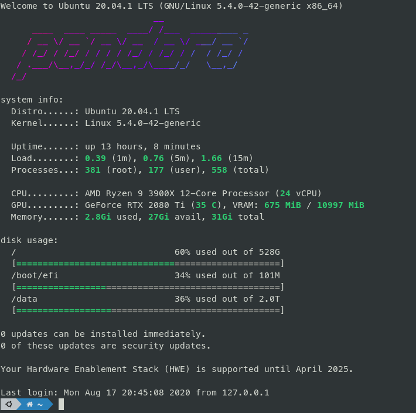

# Message of the Day

 

Collection of my `motd` scripts. Tested only on `debian-based` systems.

## Requirements

  * [figlet](http://www.figlet.org/)
  * [lolcat](https://github.com/busyloop/lolcat)

## References

  * [bcyran/fancy-motd](https://github.com/bcyran/fancy-motd)
  * [yboetz/motd](https://github.com/yboetz/motd)

## Setup

  * copy the files you want in your `motd` to `/etc/update-motd.d/`. 

